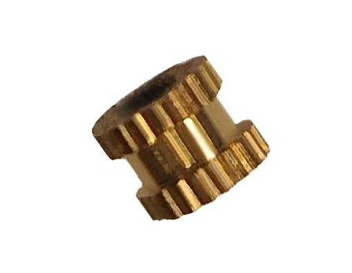

---
PartData:
    Specs:
        Type: M3
        Diameter: 4mm aprox.
        Material: Brass
        Tool needed: Soldering iron
        Supplier: -[Aliexpress](https://es.aliexpress.com/item/1005005220632314.html?)

---
# Heat insert

Threaded insert used for creating secure connections in materials. Heat is applied to soften the material, allowing the insert to be pressed or screwed in. It provides a strong threaded connection in materials like plastic, acrylic, and wood. Used in industries like electronics, automotive, and aerospace.